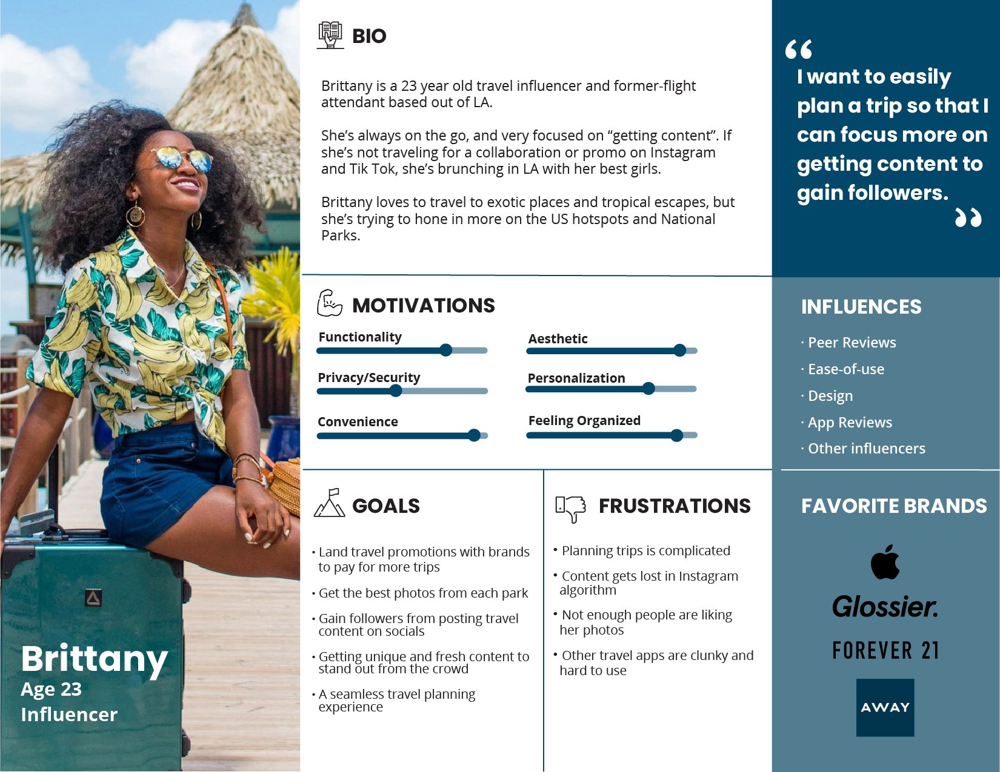

# Holiday Road from Nashville
While attending Nashville Software School, Cohort 47- We were tasked with a group project to create a 'National Parks' travel itinerary app based on a chosen 'client persona'
 
My main contributions included writing Javascript to populate itinerary previews and detail snapshot/alert boxes to the DOM, as well as slight CSS relating to UI/UX

## Installation
git clone this repository or download zip

## Usage
1. 'serve' in the project's root directory  
2. Navigate to the project's "root directory"/api and run: 'json-server -p 8090 -w db.json'
3. API keys will be needed to access data:

     API home: https://www.nps.gov/subjects/digital/nps-data-api.htm
     API documentation: https://www.nps.gov/subjects/developer/api-documentation.htm
     List All Parks
     https://developer.nps.gov/api/v1/parks?api_key=your_api_key

     Weather API
     https://openweathermap.org/api

     Bizarre Destination
     http://holidayroad.nss.team/bizarreries

     Eateries Destination
     http://holidayroad.nss.team/eateries

## Contributing
[Jackson Goodman](https://github.com/jacksonrgoodman)  
[Colten Mayberry](https://github.com/coltmay)  
[Sidney Crandall](https://github.com/SidneyCrandall)  

## License
[MIT](https://choosealicense.com/licenses/mit/)

## Selected Persona

